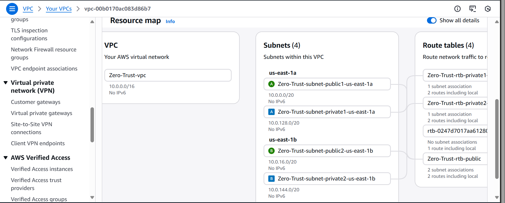
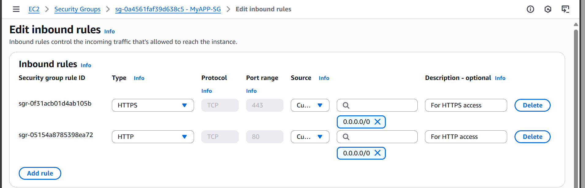
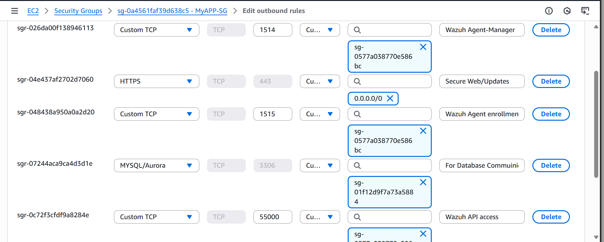

# Cloud-Native Security Architecture with IAM, SIEM, SOAR, CSPM & Incident Response Exercise

[](https://aws.amazon.com/)
[](https://wazuh.com/)
[](https://attack.mitre.org/)
[](https://www.gnu.org/software/bash/)
[](https://www.python.org/)
[](https://boto3.amazonaws.com/v1/documentation/api/latest/index.html)


## 📋 Project Overview

This project demonstrates how I designed and implementated a comprehensive, multi-layered cloud security defense architecture based on **network segmentation principles** to prevent lateral movement.
I integrated:

 -**Security Information and Event Management (SIEM) & File Integrity Monitoring (FIM)** for centralized threat detection (using **CloudTrail-S3Bucket/CloudwatchLog/Wazuh-dasboard**),
 
 -**Security Orchestration, Automation, and Response (SOAR)** for automated containment and remediation (using **Wazuh active-response/Custom bash scripting**),
 
 -**Cloud Security Posture Management (CSPM)** for continuous compliance monitoring (using **AWS Config/EventBus/Python/Boto3 Lambda function**).
 
-I **validated** the impementation through a documented **Incident Response Exercise**, where I simulated an attack (**Red Team**), detected and remediated it (**Blue Team**)

### 🎯Why This Project Matters

Modern cloud environments face critical security challenges:
- **Lack of visibility:** Absence of comprehensive logging into AWS API activity and infrastructure changes limits effective monitoring and early detection of security-sensitive events.
- **Delayed threat detection:** - Traditional perimeter security and reactive logging can be insufficient, resulting in extended attacker dwell time.
- **Manual incident response:** - Manual incident handling processes lead to high Mean Time To Respond (MTTR), increasing the potential impact of a breach.
- **Configuration drift:** - Continuous changes in cloud environments can lead to security misconfigurations, creating immediate exposure risk.
- **Compliance gaps:** - Difficulty proving continuous adherence to standards (e.g., PCI DSS, HIPAA) due to lack of real-time monitoring and automated reporting.

### 💡 Why It Works

A **three-phase security architecture** implementing:

1. **Protect (Preventative Guardrails)** - Network Segmentation with least-privilege access controls to reduce attack surface.
2. **Detect (Centralized Visibility)** - Centralized SIEM/FIM for real-time file integrity monitoring, log aggregation, custom correlation, and high-fidelity threat detection for API activity in a cloud environment.
3. **Respond (Automated Containment):** - Automated incident containment (SOAR) and compliance enforcement (CSPM)


---

## 📚 Table of Contents

- [Technology Stack](#-technology-stack)
- [Phase 1: Network Segmentation and Least Privilege Access Controls](#-phase-1-network-segmentation-and-least-privilege-access-controls)
  - [1.1 VPC Network Design](#11-vpc-network-design)
  - [1.2 Security Group Microsegmentation](#12-security-group-microsegmentation)
  - [1.3 CloudTrail Audit Logging](#13-cloudtrail-audit-logging)
  - [1.4 VPC Flow Logs](#14-vpc-flow-logs)
- [Phase 2: Centralized SIEM Monitoring](#-phase-2-centralized-siem-monitoring)
- [Phase 3: Automated Response & CSPM](#-phase-3-automated-response--cspm)
- [Security Outcomes](#-security-outcomes)
- [Lessons Learned](#-lessons-learned)
- [Future Enhancements](#-future-enhancements)
- [Cost Analysis](#-cost-analysis)
- [How to Reproduce](#-how-to-reproduce)
- [References](#-references)

---

## 🛠️ Technology Stack

| Layer | Technology | Purpose |
|-------|------------|---------|
| **Network** | AWS VPC, Security Groups | Microsegmentation, network isolation |
| **Compute** | EC2 (Ubuntu 22.04) | Web server, database, SIEM infrastructure |
| **SIEM** | Wazuh 4.7.5 | Log aggregation, correlation, alerting |
| **FIM** | Wazuh FIM | File integrity monitoring |
| **Visualization** | Wazuh Dashboard | Security monitoring and incident analysis |
| **Indexing** | OpenSearch (Wazuh Indexer) | Log storage and search |
| **Logging** | CloudTrail, VPC Flow Logs | AWS API audit + network traffic metadata |
| **SOAR** | Wazuh Active Response, Bash | Automated IP blocking |
| **CSPM** | AWS Lambda (Python 3.12/Boto3) | Auto-remediation of misconfigurations |
| **Orchestration** | EventBridge | Event-driven automation triggers |
| **Access** | AWS Systems Manager Session Manager | Bastion-less secure access |
| **IAM** | AWS IAM Roles & Policies | Least-privilege access control |
| **Firewall** | iptables | Host-based firewall for active response |
| **Cloud Services** | S3, CloudTrail, VPC Flow Logs | Storage, audit logging, network monitoring |
| **Languages** | Python 3.12, Bash, XML, JSON | Lambda functions, automation, rule configs |
| **Frameworks** | MITRE ATT&CK, NIST CSF | Threat detection, security controls |
| **Compliance** | PCI DSS, GDPR, HIPAA | Compliance mappings and controls |

---

## 🔐 Phase 1: Network Segmentation and Least Privilege Access Controls

### Objective

To build a secure network architecture with proper separation of concerns, implementing security best practices for AWS environments. Aimed to reduce attack surface through strategic subnet placement, least-privilege security groups, and identity-based access controls.


### Security Architecture Principles

| Principle | Implementation |
|-----------|----------------|
| **Minimal Attack Surface** | Eliminated SSH exposure via Session Manager, No port 22 open anywhere. IAM role-based access through Systems Manager. Sessions logged to CloudTrail. No SSH keys to rotate or secure |
| **Least Privilege Access** | Security groups allow only required ports/protocols |
| **Assume Breach** | Network segmentation limits lateral movement |
| **Verify Explicitly** | CloudTrail logs all actions for continuous verification |
| **Microsegmentation** | Each tier isolated with dedicated security groups |

---

### 1.1 VPC Network Design

#### Architecture Decision

I created a VPC with four subnets across two availability zones, strategically separating public-facing infrastructure from the database tier.
```
- VPC CIDR: 10.0.0.0/16
- Public Subnet 1 (us-east-1a): 10.0.0.0/20 (Web Server + Wazuh Manager)
- Public Subnet 2 (us-east-1b): 10.0.16.0/20 (Multi-AZ failover capability)
- Private Subnet 1 (us-east-1a): 10.0.128.0/20 (Database - Primary)
- Private Subnet 2 (us-east-1b): 10.0.144.0/20 (Database - Standby/Read Replica)
```

*Figure 1.1: VPC topology showing public and private subnet separation with controlled internet access*

#### Subnet Strategy

**Co-locating Web Server and Wazuh Manager:**
I placed both the web server and Wazuh Manager in the same public subnet (10.0.0.0/20) with restricted security groups.

**Why public subnets for both:**
1. **Web Server** - Obviously needs to accept HTTP/HTTPS from the internet
2. **Wazuh Manager** - Needs to be accessible by the web server agent, and I need dashboard access as the administrator.

In a **production environment**, they should be in a private subnet without a direct internet access but  via **NAT Gateway** for secure updates, **AWS Private Link** for internal cloud services and **VPN or load balancer** for inbound traffic but for a demonstration environment, putting them in a public subnet with strict security group rules was a reasonable trade-off and avoids the cost of a NAT Gateway or Application Load Balancer.

**The trade-off:**
If someone compromises the web server, they're already in the same network segment as the Wazuh Manager. Security groups still protect it by providing instance-level isolation (only specific ports open, dashboard restricted to my IP), but there's less network-level isolation.

**Multi-AZ Architecture:**
I deployed across two availability zones (us-east-1a and us-east-1b) to demonstrate high availability concepts, even though I'm only running single instances in this demo.

**Why two AZs:**
- **Database failover capability** - RDS can automatically fail over to the standby subnet if us-east-1a fails
- **Future scaling** - If I wanted to add a second web server for load balancing, I'd put it in the 1b public subnet
- **Best practice demonstration** - Shows I understand production architecture.

**Private Subnets (Database Tier):**
The database lives in the private subnets with no direct internet access:
- Primary instance in 10.0.128.0/20 (us-east-1a)
- Standby/read replica capability in 10.0.144.0/20 (us-east-1b)
- In production environment, both subnets route through NAT Gateway or VPC Endpoint for outbound connections (package updates, OS patches)
- Zero inbound routes from Internet Gateway.

**Security benefit:**
The database is network-isolated from the internet. Even if someone compromised both the web server and Wazuh Manager, they'd still need to:
1. Bypass the security group rules (only port 3306 from sg-web allowed)
2. Authenticate to the database itself
3. Navigate the fact that there's no route from the database back to the internet for data exfiltration (would need to proxy through the web server).

This is **defense in depth** - multiple layers have to fail before data is compromised.

### 1.2 Security Group Configuration

Security groups act as stateful firewalls controlling traffic at the instance level. I configured three security groups with very specific rules following the principle of least privilege.

#### Web Server Security Group
**Inbound Rules:**

*Figure 1.2:*

| Type | Protocol | Port | Source | Justification |
|------|----------|------|--------|---------------|
| HTTP | TCP | 80 | 0.0.0.0/0 | Public website access |
| HTTPS | TCP | 443 | 0.0.0.0/0 | Secure public website access |

**Outbound Rules:**

*Figure 1.3:*

| Type | Protocol | Port | Destination | Justification |
|------|----------|------|-------------|---------------|
| HTTP | TCP | 80 | 0.0.0.0/0 | Package repositories |
| HTTPS | TCP | 443 | 0.0.0.0/0 | Package updates, HTTPS traffic |
| Custom TCP | TCP | 1514 | sg-wazuh | Wazuh agent event forwarding |
| Custom TCP | TCP | 1515 | sg-wazuh | Wazuh agent enrollment |
| Custom TCP | TCP | 55000 | sg-wazuh | Wazuh API communication |
| MySQL | TCP | 3306 | sg-database | Database queries |

**Key Design Decisions:**

Notice the outbound rules to Wazuh and the database use **security group references** (sg-wazuh, sg-database) instead of IP addresses. This is important because:
- If instance IPs change, rules still work
- Clear intent - "web server talks to Wazuh or Database only on specific ports"
- Reduces attack surface
- Easier to audit and maintain

**SSH notably absent:**
There's no SSH (port 22) rule. Instead, I use AWS Systems Manager Session Manager (configured via IAM role) for administrative access. This eliminates the need to expose SSH and manage SSH keys, which are common attack vectors.

#### Wazuh Manager Security Group
**Inbound Rules:**

*Figure 1.3:*

| Type | Protocol | Port | Source | Justification |
|------|----------|------|--------|---------------|
| Custom TCP | TCP | 1514 | sg-web | Agent log events |
| Custom TCP | TCP | 1515 | sg-web | Agent registration |
| Custom TCP | TCP | 55000 | sg-web | Wazuh API (agent management) |
| HTTPS | TCP | 443 | My IP (41.x.x.x/32) | Wazuh dashboard access |

**Outbound Rules:**

| Type | Protocol | Port | Destination | Justification |
|------|----------|------|-------------|---------------|
| HTTPS | TCP | 443 | 0.0.0.0/0 | AWS API calls, package updates |
| HTTP | TCP | 80 | 0.0.0.0/0 | Domain name resolution |

**Critical security controls:**

1. **Agent ports (1514, 1515, 55000) only accept connections from sg-web**
   - Even though Wazuh Manager is in a public subnet, these ports can't be reached from the internet
   - Only the web server can connect
   - If I had multiple agents in production, I'd allow their security groups too

2. **Dashboard access (443) restricted to my IP address**
   - I'm the only one who can access the Wazuh web interface
   - This prevents unauthorized access to the SIEM
   - **In production**, this would be:
     - Multiple admin IPs (SOC team)
     - VPN endpoint (all admins route through VPN)
     - AWS PrivateLink (no public access at all)
     - Or behind a bastion host in private subnet

**Why I allowed my specific IP:**
The Wazuh dashboard contains sensitive security information - alerts, logs, configuration. Allowing access from only my IP (41.x.x.x/32) means even if someone knew the Wazuh Manager's public IP, they couldn't reach the dashboard. This is a compromise for a demo environment; production would use VPN or PrivateLink to avoid public exposure entirely.

**No SSH here either:**

Same as the web server - using Systems Manager Session Manager via IAM role for administrative access.

#### Database Security Group


**Inbound Rules:**

| Type | Protocol | Port | Source | Justification |
|------|----------|------|--------|---------------|
| MySQL | TCP | 3306 | sg-web | Database queries from web application |

**Outbound Rules:**

| Type | Protocol | Port | Destination | Justification |
|------|----------|------|-------------|---------------|
| All traffic | All | All | 0.0.0.0/0 | Response traffic (stateful) |


**Most restrictive security group:**
The database accepts connections ONLY from the web server security group. Nothing else can reach port 3306.

**In a production environment:**

This rule would be more complex:
```
Inbound:
- MySQL (3306) from sg-web
- MySQL (3306) from sg-wazuh (if Wazuh agents query DB for inventory)
- MySQL (3306) from NAT Gateway IP (for automated backups)
- Systems Manager Session Manager via IAM role for administrative access.

```
For this demo, only the web server needs database access, so that's all I allowed.

**Why the database is in private subnet:**

Even with security group protection, defense in depth means adding network-level isolation. The database:
- Has no public IP address
- Cannot be reached from the internet (no IGW route)
- Must be accessed through instances that ARE in public subnets

This creates layers of security. An attacker would need to:
1. Compromise the web server
2. Bypass security group rules
3. Then reach the database

### 1.3 Identity and Access Management (IAM)

Instead of managing SSH keys and opening port 22, I used AWS IAM roles and Systems Manager Session Manager for secure instance access.

#### Web Server IAM Role

**Attached Policies:**
- `AmazonSSMManagedInstanceCore` - Enables Session Manager access


**Why this approach:**

Traditional SSH access requires:
- Managing SSH key pairs
- Opening port 22 (common attack vector)
- No audit trail of what commands were run
- Risk of compromised or leaked keys

Session Manager provides:
- No SSH keys to manage
- No port 22 exposure
- All sessions logged to CloudTrail
- Can restrict access through IAM policies
- Can record session commands for compliance

**Access workflow:**
```
Admin → AWS Console → Systems Manager → Session Manager → Web Server
                            ↓
                      CloudTrail Log
```

Every session is logged: who connected, when, and (optionally) what commands they ran.

#### Wazuh Manager IAM Role

**Attached Policies:**
1. `AmazonS3ReadOnlyAccess` - Read CloudTrail logs from S3
2. `AmazonSSMManagedInstanceCore` - Session Manager access
3. `CloudWatchLogsReadOnlyAccess` - Read CloudWatch logs


**Why these permissions:**

**1. AmazonS3ReadOnlyAccess:**

The Wazuh Manager needs to read CloudTrail logs from the S3 bucket (`zerotrust123`) to ingest AWS API activity into the SIEM. The `aws-s3` module in Wazuh polls this bucket every 10 minutes for new logs.

Read-only is sufficient - Wazuh only needs to `GetObject` and `ListBucket`, not write or delete.

**2. CloudWatchLogsReadOnlyAccess:**

For VPC Flow Logs integration which I configured to go to CloudWatchLogs. 

**3. AmazonSSMManagedInstanceCore:**

Session Manager access for administrative tasks (checking logs, restarting services, troubleshooting).

**Least privilege consideration:**

In production, I'd use a custom IAM policy instead of AWS managed policy for S3Bucket Read Access:
```json
{
  "Version": "2012-10-17",
  "Statement": [
    {
      "Effect": "Allow",
      "Action": [
        "s3:GetObject",
        "s3:ListBucket"
      ],
      "Resource": [
        "arn:aws:s3:::zerotrust123",
        "arn:aws:s3:::zerotrust123/*"
      ]
    }
  ]
}
```
This is more restrictive than `AmazonS3ReadOnlyAccess` which allows reading from ALL S3 buckets in the account. For a demo, the managed policy is fine, but production should be scoped to specific resources.

---

### 1.4 CloudTrail Audit Logging

#### Why CloudTrail

AWS doesn't log API activity by default. Without CloudTrail, if someone:
- Modified a security group
- Created an EC2 instance
- Changed an IAM policy
- Accessed an S3 bucket

...there would be no record of it. CloudTrail provides an audit trail of every API call made in the AWS account and it's immutable.

**What CloudTrail captures:**

For every API call:
- **Who** - IAM user or role that made the call
- **What** - The specific action (RunInstances, DeleteBucket, etc.)
- **When** - Timestamp
- **Where** - Source IP address and AWS region
- **How** - Whether it succeeded or failed
- **Why** - Request parameters (what was changed)

#### Configuration


| Setting | Value | Why |
|---------|-------|-----|
| **Trail Name** | zerotrust-trail | Descriptive naming |
| **S3 Bucket** | zerotrust123 | Centralized log storage |
| **Log File Validation** | Enabled | Detect log tampering |
| **Multi-Region** | Yes | Capture activity across all AWS regions |
| **Management Events** | All (read + write) | Complete visibility |

**S3 bucket for logs:**

CloudTrail writes logs to S3 bucket `zerotrust123`. I configured the bucket with:
- Server-side encryption (SSE-S3)
- Versioning enabled (can't overwrite logs)
- Block public access (logs should never be public)

**Bucket policy - least privilege:**

Only CloudTrail service can write to this bucket:
```json
{
	"Version": "2012-10-17",
	"Statement": [
		{
			"Sid": "AWSCloudTrailAclCheck20150319-b3f0c3ca-3e2c-46a2-bb6f-84b9816fe146",
			"Effect": "Allow",
			"Principal": {
				"Service": "cloudtrail.amazonaws.com"
			},
			"Action": "s3:GetBucketAcl",
			"Resource": "arn:aws:s3:::zerotrust123",
			"Condition": {
				"StringEquals": {
					"AWS:SourceArn": "arn:aws:cloudtrail:us-east-1:011555818509:trail/ZeroTrust-Trail"
				}
			}
		},
		{
			"Sid": "AWSCloudTrailWrite20150319-db5b4ad8-3321-49ba-b688-ee03fb63efe1",
			"Effect": "Allow",
			"Principal": {
				"Service": "cloudtrail.amazonaws.com"
			},
			"Action": "s3:PutObject",
			"Resource": "arn:aws:s3:::zerotrust123/AWSLogs/011555818509/*",
			"Condition": {
				"StringEquals": {
					"AWS:SourceArn": "arn:aws:cloudtrail:us-east-1:011555818509:trail/ZeroTrust-Trail",
					"s3:x-amz-acl": "bucket-owner-full-control"
				}
			}
		}
	]
}
```
#### Integration with Wazuh

CloudTrail logs are ingested into Wazuh SIEM (configured in Phase 2) for real-time monitoring. This enables:
- Alerts on suspicious API calls (privilege escalation, security group changes)
- Correlation with host-based events
- Investigation of security incidents
- Compliance reporting

#### Events Captured

**Example CloudTrail events logged:**


---

### 1.5 VPC Flow Logs

#### Purpose

VPC Flow Logs capture metadata about network traffic - not the packet contents, but information about connections:
- Which IPs are talking to each other
- What ports they're using
- Whether the connection was allowed or denied
- How much data was transferred

This is useful for:
- Detecting port scanning
- Identifying data exfiltration
- Troubleshooting connectivity issues
- Network forensics during incidents

#### Configuration


| Setting | Value | Why |
|---------|-------|-----|
| **Filter** | All (Accept + Reject) | See both allowed and blocked traffic |
| **Destination** | Cloudwatch Log | Long-term storage |
| **Aggregation** | 10 minutes | Balance between detail and cost |

**IAM Role for VPC Flow Logs:**

This follows least privilege - only the VPC Flow Logs service can

#### Security Posture Achieved

**Attack surface reduction:**

| Before | After | Improvement |
|--------|-------|-------------|
| SSH exposed to internet | No SSH exposure (Session Manager) | Eliminated common attack vector |
| No API activity logging | CloudTrail enabled | Complete audit trail |
| No network visibility | VPC Flow Logs collecting | Network forensics capability |
| Overly permissive SGs | Least-privilege rules | Reduced blast radius |
| No database isolation | Private subnet isolation | Defense in depth |

**What this architecture accomplishes:**
- Separates public-facing and sensitive infrastructure
- Reduces attack surface through security group least privilege
- Eliminates SSH key management risks
- Provides foundation for SIEM monitoring (Phase 2)
- Creates audit trail for compliance and incident response

**Where it falls short of enterprise production:**
- Wazuh Manager should be in private subnet or behind VPNS
- Web Server should be in private subnet behind a load balancer
- Should use AWS PrivateLink to eliminate public internet traffic for AWS API calls and NAT Gateways for updates
- IAM policies could be more granular
- Missing DDoS protection (AWS Shield Advanced)
- Single points of failure (no high availability)

These trade-offs are appropriate for a demonstration environment. The architecture shows I understand the principles and can articulate what production would require.

---

## Phase 2: Centralized SIEM Monitoring

### Objective

Deploy Wazuh as a centralized Security Information and Event Management (SIEM) platform to aggregate, correlate, and analyze security events from multiple sources: host-based monitoring (file integrity, authentication logs) and cloud-based monitoring (AWS CloudTrail API activity and VPC Flow Logs).

The goal was to create a single pane of glass for security visibility across both infrastructure and cloud layers.

---

### 2.1 Why Wazuh

**Choosing a SIEM:**

I needed a SIEM that could:
- Monitor Linux hosts (file changes, login attempts, system events)
- Ingest AWS CloudTrail logs from S3 and VPC Flow logs from CloudWatch logs
- Run custom detection rules
- Provide a web dashboard for visualization
- Be free/open-source (budget constraint for demo)

**Options I considered:**
- **Splunk** - Powerful but expensive, requires license even for demo
- **Wazuh** - Open-source, built-in AWS integration, agent-based monitoring ✅

Wazuh is essentially ELK (now OpenSearch) with security-focused pre-built features : agents, decoders, rules, and CloudTrail integration.

---

**All-in-One Installation:**

Wazuh offers an "all-in-one" installation that puts Manager, Indexer, and Dashboard on a single instance. This is not recommended for production (should be separate instances for scale), but acceptable for demo purposes.

### 2.3 Wazuh Manager Installation

**Instance Specifications:**

| Setting | Value | Justification |
|---------|-------|---------------|
| **Instance Type** | t3.large | 2 vCPU, 8GB RAM (minimum for Wazuh + OpenSearch) |
| **OS** | Ubuntu 22.04 LTS | Wazuh official support |
| **Disk** | 20GB gp3 | Initially 8GB, increased after disk full issues |
| **Subnet** | Public (10.0.8.0/24) | As discussed in Phase 1 |
| **Security Group** | sg-wazuh | Restricted access |

**Installation:**


I used Wazuh's automated installation script:
```bash
# Download installation script
curl -sO https://packages.wazuh.com/4.7/wazuh-install.sh

# Run all-in-one installation
sudo bash ./wazuh-install.sh -a
```
The script installs:
1. Wazuh Manager (log processing engine)
2. Wazuh Indexer (OpenSearch for storage)
3. Wazuh Dashboard (web interface)
4. Filebeat (log shipping)

**First login:**


Accessed the dashboard at `https://10.0.8.30` (remember, I restricted this to my IP in the security group).

### 2.4 Wazuh Agent Deployment

**Target:** Web server (MyApp) in public subnet


**Installation on web server:**
```bash
# Download agent package
curl -so wazuh-agent.deb https://packages.wazuh.com/4.x/apt/pool/main/w/wazuh-agent/wazuh-agent_4.7.5-1_amd64.deb
# Install with manager IP
sudo WAZUH_MANAGER='10.0.8.30' dpkg -i wazuh-agent.deb

# Start agent
sudo systemctl daemon-reload
sudo systemctl enable wazuh-agent
sudo systemctl start wazuh-agent
```
**Verification:**

On the Wazuh Manager, check connected agents:
```bash
sudo /var/ossec/bin/agent_control -l
```

Output:
```
Wazuh agent_control. List of available agents:
   ID: 001, Name: MyApp, IP: 10.0.1.5, Status: Active
```

**In the dashboard:**


The agent shows as "Active" with last keep-alive timestamp. This confirms:
- Network connectivity (ports 1514, 1515 working)
- Agent was successfully enrolled
- Manager is receiving events
---

### 2.5 File Integrity Monitoring (FIM)

**What is FIM:**

File Integrity Monitoring tracks changes to files and directories. If someone modifies critical system files or web content, FIM will detect it and generate an alert.

**Why it matters:**

Common attack pattern:
### Attack Pattern 1: Web Defacement / Malware Distribution
1. Attacker compromises a web server (via SQL injection, RCE, etc.)
2. Modifies `/var/www/html/index.html` to serve malware or phishing content
3. **FIM Detection:** Wazuh alerts on unauthorized changes to web root
4. **Impact:** Visitors download malware, site reputation damaged, SEO poisoning

### Attack Pattern 2: Backdoor User Creation
1. Attacker gains root access (privilege escalation vulnerability)
2. Modifies `/etc/passwd` or `/etc/shadow` to create backdoor user account
3. **FIM Detection:** Wazuh alerts on critical system file modification
4. **Impact:** Persistent access even after patching initial vulnerability

### Attack Pattern 3: SSH Backdoor / Persistence
1. Attacker escalates privileges on compromised system
2. Modifies `/etc/ssh/sshd_config` to enable root login, add authorized keys, or disable logging
3. **FIM Detection:** Wazuh alerts on SSH configuration changes
4. **Impact:** Attacker maintains remote access, evades detection and uses system as pivot point

FIM detects these changes in real-time.

**Configuration:**

Wazuh agent comes with default FIM configuration in `/var/ossec/etc/ossec.conf`

**What gets monitored:**
- File creation/deletion
- Content changes (checksum)
- Permission changes
- Ownership changes

**Testing FIM:**
I modified the web server's index page,


**Result - Alert triggered:**


**Alert details:**
- **Rule ID:** 550 (File integrity checksum changed)
- **Severity:** Level 7 (Medium)
- **File:** `/var/www/html/index.html`
- **Change type:** Content modification
- **Timestamp:** Within 30 seconds of change
- **Checksum:** MD5/SHA1 hash changed

**This demonstrates detection of unauthorized file changes in real-time.**

**Events overview:**


The dashboard shows all security events captured over 7 days:

**Metrics:**
- **480 total events**
- **111 successful authentications** (SSH sessions via Session Manager)
- **0 authentication failures** (no brute-force attempts detected)
- **0 critical alerts (Level 12+)**

**Event timeline:**


The graph shows activity spikes on Oct 17 (when I was actively working on the project). Normal baseline activity is usually much lower.

**Host-based monitoring working:**

The 480 events prove the agent is successfully forwarding logs from the web server to the Wazuh Manager for analysis.

---

### 2.7 AWS Logs Integration (CloudTrail + VPC Flow Logs)

**Objective:** To ingest AWS security logs from multiple sources into Wazuh for comprehensive visibility on cloud activities- both API-level actions (CloudTrail) and network-level traffic (VPC Flow Logs).

**Why both sources matter:**
These two log sources provide complementary visibility:

| Log Source | What It Captures | Use Case |
|------------|------------------|----------|
| **CloudTrail** | WHO did WHAT at the API level | IAM changes, security group modifications, resource creation |
| **VPC Flow Logs** | WHAT connected to WHAT at the network level | Port scanning, data exfiltration, lateral movement |

**Example scenario:**

Attacker compromises IAM credentials:
1. **CloudTrail shows:** User "admin" modified security group (API call)
2. **VPC Flow Logs show:** External IP now connecting to previously blocked port (network traffic)

Together, they tell the complete story of the attack.

---
#### Architecture Decision: Integration Methods

**I used two different integration methods:**

**CloudTrail → S3 → Wazuh**
```
CloudTrail writes to S3 → Wazuh polls S3 every 10 min → Events ingested
```

**VPC Flow Logs → CloudWatch → Wazuh**
```
Flow Logs write to CloudWatch → Wazuh subscribes to log stream → Events ingested
```
#### Wazuh Integration Configuration

**Single configuration for both sources in `/var/ossec/etc/ossec.conf`:**
```xml
```
**IAM permissions required:**

Remember from Phase 1, the Wazuh Manager IAM role has:
- `AmazonS3ReadOnlyAccess` - For CloudTrail bucket access
- `CloudWatchLogsReadOnlyAccess` - For VPC Flow Logs access

The IAM role provides credentials automatically (no access keys needed).

#### Verification and Troubleshooting

**Check integration status:**
```bash
sudo tail -f /var/ossec/logs/ossec.log | grep -i aws
```
**Initial issue encountered:**
**Issue: CloudWatch permissions**

Initially, I hadn't attached `CloudWatchLogsReadOnlyAccess` to the Wazuh Manager IAM role.

**Symptoms:**
```
ERROR: Unable to describe log streams
```

**Solution:** 
1. AWS Console → IAM → Roles → WazuhManagerRole
2. Attach policy: `CloudWatchLogsReadOnlyAccess`
3. Wait 30 seconds for role propagation
4. Restart Wazuh

**Lesson:** I need to always verify IAM permissions before troubleshooting Wazuh configuration.

#### AWS Logs in Wazuh Dashboard

**After both integrations started working:**


**Events visible in dashboard:**

| Event Name | Service | Description | My Action |
|------------|---------|-------------|-----------|
| CreatePolicy | iam.amazonaws.com | IAM policy creation | Creating WazuhManagerRole permissions |
| AttachRolePolicy | iam.amazonaws.com | Permissions added to role | Attaching S3ReadOnly to role |
| CreateRole | iam.amazonaws.com | New IAM role created | Creating VPC Flow Logs IAM role |
| AuthorizeSecurityGroupIngress | ec2.amazonaws.com | Firewall rule added | Testing security group detection |
| StartInstances | ec2.amazonaws.com | EC2 instance started | Restarting web server |
| PutBucketPolicy | s3.amazonaws.com | S3 permissions changed | Configuring CloudTrail bucket |
| ConsoleLogin | signin.amazonaws.com | AWS Console login | Me logging in |

#### Event Details and Context

**Clicking on a CloudTrail event shows full JSON:**


**This level of detail enables:**
- **Incident investigation:** Who made the change and why
- **Compliance auditing:** Proof of who accessed what
- **Threat hunting:** Correlation with other suspicious activity
- **Forensics:** Complete reconstruction of events

---

### 2.8 Custom Detection Rules

**Now that AWS logs are flowing into Wazuh, I created custom rules to detect cloud-specific threats.**

**Why custom rules:**
Wazuh has thousands of built-in rules for generic events (failed logins, file changes), but AWS-specific threats require custom detection logic:
- Security group modifications
- Root account usage
- S3 buckets made public
- IAM privilege escalation

**Rules created:** 6 custom rules mapped to **MITRE ATT&CK framework**

#### Rule Creation Process

**Created `/var/ossec/etc/rules/local_rules.xml`:**


```xml
```

#### Rule Breakdown and Testing

**Rule 100010 - Security Group Modifications:**

**Logic:**
```xml
80202  
AuthorizeSecurityGroupIngress
```

**Triggers when:** Someone adds/removes security group rules

**Why critical:** Security groups are cloud firewalls. Unauthorized changes could:
- Expose infrastructure (0.0.0.0/0 on SSH)
- Block legitimate traffic (remove required rules)
- Create backdoors

**MITRE ATT&CK:** T1562.007 - Disable or Modify Cloud Firewall  
**Severity:** Level 10 (High)

**Testing:**
```
AWS Console → EC2 → Security Groups → WebServer-SG
Edit inbound rules → Add: SSH (22) from 0.0.0.0/0 → Save
```
Alert triggered (after 15-20 min delay) showing:
- **Event:** AuthorizeSecurityGroupIngress
- **User:** admin (me)
- **Security Group:** sg-web
- **Rule added:** SSH 0.0.0.0/0
- **Source IP:** 41.203.x.x (Lagos)

**In production:** This alert would trigger immediate investigation:
- Is this authorized change?
- Who approved it?
- Does it violate policy?
- Should it be reverted?

I remediated immediately by removing the SSH rule.

---

**Rule 100014 - Root Account Usage:**

**Logic:**
```xml
^Root$
```

**Triggers when:** AWS root account is used

**Why critical:** AWS best practice = NEVER use root for daily operations. Root has:
- Unlimited permissions (can't be restricted)
- Can close account
- Can change billing
- Can modify organization settings

**MITRE ATT&CK:** T1078.004 - Cloud Accounts  
**Severity:** Level 12 (Critical)

**Usage can indicate**:
- Policy violation (employee using root inappropriately)
- Compromised credentials (attacker got root password)
- Emergency situation (should be documented)

**Testing:**

Logged out of AWS Console, logged back in as root user

Alert triggered immediately showing:
- **User type:** Root
- **Event:** ConsoleLogin
- **Source IP:** My IP
- **Timestamp:** Login time

**This would be a critical incident in production:**
- Page on-call engineer immediately
- Investigate: Who? Why? Authorized?
- Review all actions taken with root
- Consider rotating root credentials
- Document justification if legitimate
---

**Rule 100013 - Brute Force Detection:**

**Logic:**
```xml
100012  
3  
300  
  
```

**Triggers when:** 3+ failed console logins from same IP within 5 minutes

**Why it matters:** Signature of password guessing attack

**MITRE ATT&CK:** T1110 - Brute Force  
**Severity:** Level 10 (High)
**Rule chaining:**
1. Rule 100012 detects EACH failed login (Level 8)
2. Rule 100013 correlates multiple failures (Level 10)

**This demonstrates Wazuh's correlation engine** - connecting events over time.

**I didn't test this** (didn't want to risk account lockout), but the logic follows standard Wazuh correlation patterns used in production SIEMs.

---

#### MITRE ATT&CK Mapping Summary

**All 6 custom rules mapped to MITRE framework:**

| Rule ID | Rule Name | MITRE Technique | Tactic | Severity |
|---------|-----------|-----------------|--------|----------|
| 100010 | Security Group Changes | T1562.007 - Disable Cloud Firewall | Defense Evasion | 10 (High) |
| 100012 | Failed Console Login | T1078 - Valid Accounts | Initial Access | 8 (Medium) |
| 100013 | Brute Force | T1110 - Brute Force | Credential Access | 10 (High) |
| 100014 | Root Account Usage | T1078.004 - Cloud Accounts | Initial Access | 12 (Critical) |
| 100015 | S3 Made Public | T1530 - Data from Cloud Storage | Collection | 12 (Critical) |
| 100016 | IAM Changes | T1098 - Account Manipulation | Persistence | 9 (High) |

**MITRE ATT&CK tactics covered:**
```
Initial Access → Persistence → Defense Evasion → Credential Access → Collection
   (100012)        (100016)        (100010)          (100013)        (100015)
   (100014)
```
**Why MITRE mapping is important:**

1. **Common language:** Other security professionals immediately understand the threat
2. **Threat intelligence:** Can correlate with known attacker TTPs
3. **Playbook mapping:** Each technique has response procedures
4. **Maturity assessment:** Shows coverage across attack lifecycle
5. **Communication:** Easily explain to executives ("We detect T1078.004")
---

#### Detection Timelines

**How long from action to detection:**

**CloudTrail detection timeline:**
```
Action → CloudTrail buffer (5-10 min) → S3 write (5-10 min) → 
Wazuh polls (0-10 min) → Processing (1-2 min) → Alert

Total: 15-30 minutes
```

**VPC Flow Logs detection timeline:**
```
Connection → Flow aggregation (10 min) → CloudWatch write (1 min) → 
Wazuh subscribes (real-time) → Processing (1 min) → Alert

Total: 10-15 minutes
```
**Host logs (for comparison):**
```
Event → Agent captures (real-time) → Send to manager (seconds) → 
Processing (seconds) → Alert

Total: 30 seconds
```

**What this means:**

- **CloudTrail:** Good for investigations, not immediate response
- **VPC Flow Logs:** Slightly faster, good for network monitoring
- **Host logs:** True real-time, best for immediate threats
- **EventBridge (Phase 3):** Near real-time for critical CloudTrail events
---
#### What This Integration Achieves

**Before AWS log integration:**
```
CloudTrail: Logs in S3, never looked at
Flow Logs: Not configured
Visibility: API activity = none, Network = none
Investigation: Manual S3 download and JSON parsing
Alerting: None
```

**After AWS log integration:**
```
CloudTrail: Ingested, analyzed, alertable (15-20 min)
Flow Logs: Visible in dashboard (10-15 min)
Visibility: API activity = complete, Network = complete
Investigation: Dashboard search with filters
Alerting: Custom rules (Phase 2.8)
```
**Security capabilities now possible:**

✅ **Detect unauthorized infrastructure changes** (security groups, IAM)  
✅ **Identify reconnaissance activity** (port scans, failed connections)  
✅ **Discover lateral movement** (unexpected internal connections)  
✅ **Investigate incidents** (complete audit trail with context)  
✅ **Prove compliance** (all actions logged and searchable)  
✅ **Correlate across layers** (API + network + host events)  

---

#### Production Recommendations

**For a real SOC deployment:**

**1. Implement log filtering**
- VPC Flow Logs: Only REJECT events initially
- CloudTrail: Focus on write events (read events create noise)
- Add more as team matures

**2. Set up lifecycle policies**
```
Day 1-30: SIEM (hot storage, fast queries)
Day 31-90: S3 Standard (warm storage, slower queries)
Day 91-365: S3 Glacier (cold storage, for compliance)
Year 2-7: S3 Deep Glacier (archive, rarely accessed)
```

**3. Monitor integration health**
- Alert if no CloudTrail events for 30 minutes
- Alert if no Flow Logs for 15 minutes
- Dashboard showing "last event received" timestamps
  
**4. Automate via Infrastructure as Code**
Makes deployments repeatable and documented.

**5 Integrate Tuning process:**
- Create rules → Generate alerts → Lots of noise
- Add exclusions → Filter false positives → Less noise
- Adjust severity → Prioritize critical alerts → Actionable
- Document baseline → "Normal" behavior defined → Production-ready
---

#### What This Phase Enables for Phase 3

**Phase 2 creates detection → Phase 3 adds response:**
```
WITHOUT Phase 2 SIEM:
Event occurs → Nobody knows → No response → Attacker wins

WITH Phase 2 SIEM:
Event occurs → Detected → Alert generated → Manual investigation → Manual response
(Minutes to detect, Hours to respond)

WITH Phase 2 + Phase 3 (SOAR):
Event occurs → Detected → Alert generated → AUTOMATIC response → Threat contained
(Minutes to detect, SECONDS to respond)
```
**Phase 2 detects threats.**  
**Phase 3 stops threats.** 
---

## Phase 3: Automated Response & CSPM

### Objective

Transition from **detection** (Phase 2) to **automated response** - reducing Mean Time to Respond (MTTR) from hours/minutes to seconds. Implement Security Orchestration, Automation, and Response (SOAR) for threat containment and Cloud Security Posture Management (CSPM) for compliance enforcement.

**Phase 2 detected threats. Phase 3 stops them automatically.**

---
### 3.1 SOAR: Automated Brute Force Protection

#### The Threat: SIEM Dashboard Compromise

**Scenario:**

An attacker discovers the Wazuh dashboard is accessible at `https://<wazuh-manager-ip>`. They attempt to brute force the admin credentials.

**Why this is critical:**

If an attacker gains access to the SIEM dashboard, they can:
- **Disable detection rules** - Turn off alerts for their activities
- **Delete logs** - Cover their tracks by removing evidence
- **View sensitive data** - See all security events, including credentials in logs
- **Identify blind spots** - Learn what ISN'T monitored and exploit it
- **Manipulate alerts** - Create false alerts to distract SOC team
- **Pivot to infrastructure** - Dashboard has access to all monitored systems

**Compromising the security monitoring system is a high-value target for attackers.**
In enterprise breaches, attackers often target SIEM/logging infrastructure early to avoid detection.

---
#### Solution Architecture

**Automated response workflow:**
```
Failed Dashboard Login (1) → Wazuh detects → Rule 100050 fires (Level 8)
        ↓
Failed Dashboard Login (2) → Wazuh correlates → Rule 100050 fires again
        ↓
Failed Dashboard Login (3) → Wazuh correlation engine → Rule 100051 fires (Level 12)
        ↓
wazuh-execd (active response daemon) → Sees 100051 alert → Executes firewall-block.sh
        ↓
Bash script adds iptables rule → Source IP blocked for 10 minutes → Attack contained
        ↓
Auto-timeout: After 10 minutes → wazuh-execd calls script with 'delete' → IP unblocked
```

#### Implementation Details

**Challenge: Getting Wazuh to Recognize Dashboard Authentication Events**

**Initial problem:**

Wazuh was triggering the generic authentication rule (2501 - Level 6) for failed logins, but I needed to:
1. Specifically identify Wazuh Dashboard authentication failures
2. Count individual failures for correlation
3. Trigger custom rule with higher severity

**Solution: Custom decoder + Chained rules**

---

**Step 1: Create Custom Decoder**

**Created decoder in `/var/ossec/etc/decoders/local_decoder.xml`:**


```xml

  wazuh-dashboard
  authentication failure from (\S+); user=(\S+)
  srcip, user

```
**What this decoder does:**

- **`<program_name>`** - Matches logs from "wazuh-dashboard" process
- **`<regex>`** - Extracts source IP and username from log message
- **`<order>`** - Maps regex capture groups to fields (srcip, user)

**Example log line it parses:**
```
wazuh-dashboard: authentication failure from 203.0.113.50; user=admin
```

**Extracted fields:**
- `srcip` = 203.0.113.50
- `user` = admin

**Why this matters:**
Without the decoder, Wazuh sees the log but can't extract the source IP. The `<same_source_ip />` condition in Rule 100051 wouldn't work. The decoder makes the IP field available for correlation.

---
**Step 2: Create Custom Detection Rules**

**Created rules in `/var/ossec/etc/rules/local_rules.xml`:**


```xml


  
  
    2501
    wazuh-dashboard
    Failed authentication attempt to Wazuh Dashboard
    authentication_failed,pci_dss_10.2.4,pci_dss_10.2.5,
100050
    
    Multiple failed authentication attempts to Wazuh Dashboard - Possible brute force attack
    
      T1110.001
    
    authentication_failures,pci_dss_10.2.4,pci_dss_10.2.5,
  


```
**Rule architecture breakdown:**

**Rule 100050 (Individual Failed Login):**
```xml
2501  
wazuh-dashboard  
7  
```

**Why depend on rule 2501?**

Rule 2501 is Wazuh's built-in generic authentication failure rule. By using `<if_sid>2501</if_sid>`, I'm saying:

"If rule 2501 fires (authentication failure) AND it's from wazuh-dashboard program, then also fire rule 100050"

This is **rule inheritance** - building specific detection on top of generic patterns.

**Why Level 7 instead of Level 8?**

- Rule 2501 (generic) = Level 6
- Rule 100050 (specific) = Level 7 (higher than parent, but still medium)
- Rule 100051 (correlation) = Level 10 (high severity)

This creates a severity escalation:
```
Generic auth failure (6) → Dashboard auth failure (7) → Brute force (10)
```
**How correlation works:**s
```
Attempt 1: Rule 100050 fires → Wazuh remembers: srcip=203.0.113.50, count=1
Attempt 2: Rule 100050 fires → Wazuh checks: same IP? Yes. Count=2
Attempt 3: Rule 100050 fires → Wazuh checks: same IP? Yes. Count=3 → Triggers 100051!
```

Wazuh's correlation engine tracks:
- How many times 100050 fired
- From which source IP
- Within the 2-minute timeframe

When threshold is met (3 attempts, same IP, 2 minutes), Rule 100051 fires.

**MITRE ATT&CK mapping:**

- **T1110.001** - Brute Force: Password Guessing
- **Tactic:** Credential Access
- **Sub-technique:** Password guessing (vs. password spraying or credential stuffing)

---

**Step 3: Create Active Response Script**

**Created `/var/ossec/active-response/bin/firewall-block.sh`:**


```bash
#!/bin/bash
# firewall-block.sh - Wazuh 4.x+ format with JSON input
# Compatible with Wazuh 4.0+

LOCAL=`dirname $0`
cd $LOCAL
cd ../
PWD=`pwd`
LOG="/var/ossec/logs/active-responses.log"

# Logging function
log() {
    echo "$(date '+%Y/%m/%d %H:%M:%S') firewall-block: $1" >> ${LOG}
}

log "=== Script started ==="

# Read JSON input from stdin
read INPUT_JSON
log "Received input: $INPUT_JSON"

# Parse JSON - try jq first, fallback to grep/sed
if command -v jq &> /dev/null; then
    ACTION=$(echo "$INPUT_JSON" | jq -r '.command' 2>/dev/null)
    SRCIP=$(echo "$INPUT_JSON" | jq -r '.parameters.alert.data.srcip' 2>/dev/null)
    
    # Fallback path structure
    if [ -z "$SRCIP" ] || [ "$SRCIP" = "null" ]; then
        SRCIP=$(echo "$INPUT_JSON" | jq -r '.alert.data.srcip' 2>/dev/null)
    fi
else
    # Manual parsing without jq
    ACTION=$(echo "$INPUT_JSON" | grep -o '"command":"[^"]*"' | cut -d'"' -f4)
    SRCIP=$(echo "$INPUT_JSON" | grep -o '"srcip":"[^"]*"' | cut -d'"' -f4)
    log "Parsing without jq: ACTION=$ACTION, SRCIP=$SRCIP"
fi

# Validate inputs
if [ -z "$SRCIP" ] || [ "$SRCIP" = "null" ]; then
    log "ERROR: No source IP found in input"
    log "Input was: $INPUT_JSON"
    exit 1
fi

if [ -z "$ACTION" ]; then
    # Default to 'add' if no action specified
    ACTION="add"
    log "No action specified, defaulting to: add"
fi

log "Parsed - ACTION: $ACTION, SRCIP: $SRCIP"

# Validate IP format
if ! echo "$SRCIP" | grep -qE '^[0-9]{1,3}\.[0-9]{1,3}\.[0-9]{1,3}\.[0-9]{1,3}$'; then
    log "ERROR: Invalid IP format: $SRCIP"
    exit 1
fi

# Check if iptables exists
if ! command -v iptables &> /dev/null; then
    log "ERROR: iptables not found"
    exit 1
fi

# Execute action
case "$ACTION" in
    add)
        # Check if already blocked
        if iptables -C INPUT -s "$SRCIP" -j DROP 2>/dev/null; then
            log "IP $SRCIP is already blocked"
         else
            # Block the IP
            iptables -I INPUT -s "$SRCIP" -j DROP 2>&1 | tee -a ${LOG}
            if [ ${PIPESTATUS[0]} -eq 0 ]; then
                log "SUCCESS: Blocked IP $SRCIP"
            else
                log "ERROR: Failed to block IP $SRCIP"
                exit 1
            fi
        fi
        ;;
    delete)
        # Check if blocked
        if iptables -C INPUT -s "$SRCIP" -j DROP 2>/dev/null; then
            # Unblock the IP
            iptables -D INPUT -s "$SRCIP" -j DROP 2>&1 | tee -a ${LOG}
            if [ ${PIPESTATUS[0]} -eq 0 ]; then
                log "SUCCESS: Unblocked IP $SRCIP"
             else
                log "ERROR: Failed to unblock IP $SRCIP"
                exit 1
            fi
        else
            log "IP $SRCIP was not blocked"
        fi
        ;;
    *)
        log "ERROR: Unknown action: $ACTION"
        exit 1
        ;;
esac

log "=== Script completed ==="
exit 0
```

**Script features and error handling:**

**1. Robust JSON parsing:**
```bash
# Try jq first (proper JSON parser)
if command -v jq &> /dev/null; then
    ACTION=$(echo "$INPUT_JSON" | jq -r '.command')
    SRCIP=$(echo "$INPUT_JSON" | jq -r '.parameters.alert.data.srcip')
    
    # Try alternate JSON path if first fails
    if [ -z "$SRCIP" ] || [ "$SRCIP" = "null" ]; then
        SRCIP=$(echo "$INPUT_JSON" | jq -r '.alert.data.srcip')
    fi
else
    # Fallback to grep/sed if jq not installed
    ACTION=$(echo "$INPUT_JSON" | grep -o '"command":"[^"]*"' | cut -d'"' -f4)
    SRCIP=$(echo "$INPUT_JSON" | grep -o '"srcip":"[^"]*"' | cut -d'"' -f4)
fi
```
**Why two parsing methods?**

- **jq** is the proper way to parse JSON (reliable, handles edge cases)
- **grep/sed** is a fallback if jq isn't installed (less robust but works)

**Why try two JSON paths?**

Wazuh's JSON structure changed between versions. Different versions put `srcip` in different locations:
- Wazuh 4.0-4.3: `.parameters.alert.data.srcip`
- Wazuh 4.4+: `.alert.data.srcip`

My script tries both to ensure compatibility.

---

**2. Input validation:**
```bash
# Validate IP was extracted
if [ -z "$SRCIP" ] || [ "$SRCIP" = "null" ]; then
    log "ERROR: No source IP found in input"
    exit 1
fi

# Validate IP format (prevent command injection)
if ! echo "$SRCIP" | grep -qE '^[0-9]{1,3}\.[0-9]{1,3}\.[0-9]{1,3}\.[0-9]{1,3}$'; then
    log "ERROR: Invalid IP format: $SRCIP"
    exit 1
fi
```

**Why validate IP format?**

Security: Prevents command injection. If an attacker could somehow inject malicious data into the `srcip` field, the regex validation stops it from reaching iptables.
Example attack (prevented):
```bash
SRCIP="1.2.3.4; rm -rf /"  # Would fail regex validation
```

---

**3. Idempotency (safe to run multiple times):**
```bash
# Before blocking, check if already blocked
if iptables -C INPUT -s "$SRCIP" -j DROP 2>/dev/null; then
    log "IP $SRCIP is already blocked"
else
    # Block the IP
    iptables -I INPUT -s "$SRCIP" -j DROP
fi
```

**Why check first?**

If the script is called multiple times for the same IP (shouldn't happen, but could), it won't error trying to add duplicate iptables rules.

---
**4. Comprehensive logging:**
```bash
log() {
    echo "$(date '+%Y/%m/%d %H:%M:%S') firewall-block: $1" >> ${LOG}
}

log "=== Script started ==="
log "Received input: $INPUT_JSON"
log "Parsed - ACTION: $ACTION, SRCIP: $SRCIP"
log "SUCCESS: Blocked IP $SRCIP"
log "=== Script completed ==="
```

**Every action is logged for:**
- Debugging (if something goes wrong)
- Audit trail (who was blocked, when, why)
- Compliance (PCI DSS requires logging of security actions)

---
**5. Graceful error handling:**
```bash
if [ ${PIPESTATUS[0]} -eq 0 ]; then
    log "SUCCESS: Blocked IP $SRCIP"
else
    log "ERROR: Failed to block IP $SRCIP"
    exit 1
fi
```

**If iptables command fails:**
- Logs the error
- Exits with code 1 (Wazuh sees failure)
- Doesn't claim success when it failed

---
**Make script executable:**
```bash
sudo chmod 750 /var/ossec/active-response/bin/firewall-block.sh
sudo chown root:wazuh /var/ossec/active-response/bin/firewall-block.sh
```

**Install jq (JSON parser):**
```bash
sudo apt update && sudo apt install -y jq
```

---
**Step 4: Configure Active Response**

**In `/var/ossec/etc/ossec.conf`:**


```xml


  
  
    firewall-block
    firewall-block.sh
    yes
  

  
  
    no
    firewall-block
    server
    100051
    600
  


```

**Configuration breakdown:**

**`<command>` section:**
```xml
firewall-block  
firewall-block.sh  <!-- Script in active-response/bin/ -->
yes  
```
**`<active-response>` section:**
```xml
no  
firewall-block  
server  
100051  
600  
```

**Why `<location>server`?**

- **`server`** = Execute on Wazuh Manager (where dashboard runs)
- **`local`** = Execute on the agent that generated the alert
- **`all`** = Execute on both manager and agent

Since the dashboard is ON the Wazuh Manager, I blocked the IP on the manager itself, not on a remote agent.

**Why 10-minute timeout?**
Balance between security and usability:
- **Too short (1-2 min):** Attacker can retry immediately
- **Too long (permanent):** Legitimate user who typo'd 3 times is locked out forever
- **10 minutes:** Long enough to stop automated attacks, short enough to allow recovery

**Production would use graduated response:**
- 1st offense: 10 minutes
- 2nd offense (within 24 hours): 1 hour
- 3rd offense: 24 hours
- 4th offense: Permanent + manual review required
- 
**Restart Wazuh to apply configuration:**

---
#### Testing the SOAR Automation

**I tested the SOAR automation using two methods:**

1. **Dashboard login attempts** (real attack simulation)
2. **Command-line log injection** (controlled testing with fake IP)

---

**Method 1: Real Dashboard Login Attempts**

**Attempted via web browser:**
```
https://<wazuh-manager-ip> → Login with wrong password 3 times
```

**Challenge encountered:**


```
[2025-10-23T09:50:00] [WARN] [o.o.s.a.BackendRegistry] [node-1] Authentication finally failed for admin from 127.0.0.1:60876
[2025-10-23T09:50:04] [WARN] [o.o.s.a.BackendRegistry] [node-1] Authentication finally failed for admin from 127.0.0.1:60876
[2025-10-23T09:50:07] [WARN] [o.o.s.a.BackendRegistry] [node-1] Authentication finally failed for admin from 127.0.0.1:60876
```
**Issue: All-in-one Wazuh logs authentication from localhost (127.0.0.1)**

**Why this happened:**

In an all-in-one Wazuh installation:
- Dashboard runs on the same server as the Manager
- Authentication requests come from `localhost` (127.0.0.1)
- NOT from the actual client IP making the request

**This is an architecture limitation, not a detection failure.**

**In production with separate components:**
```
User (203.0.113.50) → Load Balancer → Wazuh Dashboard (10.0.8.30) → 
Wazuh Manager (10.0.8.50) sees IP: 203.0.113.50 ✅
```
**In my all-in-one demo:**
```
User (203.0.113.50) → Wazuh Dashboard+Manager (same host) → 
Logs show: 127.0.0.1 (localhost) ❌
```

**Why blocking localhost would be catastrophic:**

If active response blocked 127.0.0.1:
- Manager couldn't talk to its own indexer
- Dashboard couldn't query the API
- **Entire SIEM would break** ❌

**Mitigation:** Localhost was whitelisted by default (production best practice)
**This is correct behavior** - you NEVER want to block localhost or internal management IPs.

---

**Method 2: Command-Line Simulation (Controlled Testing)**

**To properly test the detection and response logic, I simulated authentication failures with a fake external IP:**


**Test script:**
```bash
FAKE_IP="203.0.113.50"

for i in 1 2 3 4; do
  echo "$(date +'%b %d %H:%M:%S') $(hostname) wazuh-dashboard: authentication failure from $FAKE_IP; user=admin" | sudo tee -a /var/log/auth.log
  sleep 4
done
```
**What this does:**

1. Creates authentication failure log entries
2. Uses a fake external IP (203.0.113.50) to simulate real attacker
3. Writes to `/var/log/auth.log` (where Wazuh agent monitors)
4. Triggers the same detection rules as real attacks

**Log entries created:**
```
Oct 23 10:41:40 ip-10-0-8-30 wazuh-dashboard: authentication failure from 203.0.113.50; user=admin
Oct 23 10:41:44 ip-10-0-8-30 wazuh-dashboard: authentication failure from 203.0.113.50; user=admin
Oct 23 10:41:48 ip-10-0-8-30 wazuh-dashboard: authentication failure from 203.0.113.50; user=admin
Oct 23 10:41:52 ip-10-0-8-30 wazuh-dashboard: authentication failure from 203.0.113.50; user=admin
```

---
**Detection and Response Results:**

**Wazuh alerts triggered:**


```bash
sudo tail -f /var/ossec/logs/alerts/alerts.log | grep --color=auto -E "100050|100051"
```

Output:
```
Rule: 100050 (level 7) -> 'Failed authentication attempt to Wazuh Dashboard'
Rule: 100050 (level 7) -> 'Failed authentication attempt to Wazuh Dashboard'
Rule: 100051 (level 10) -> 'Multiple failed authentication attempts to Wazuh Dashboard - Possible brute force attack'
```
**Rules fired in sequence:**
1. First failure → Rule 100050 (Level 7)
2. Second failure → Rule 100050 (Level 7)
3. Third failure → Rule 100051 (Level 10) ✅

---

**Active response execution:**


```bash
sudo tail -n0 -f /var/ossec/logs/active-responses.log
```
Output:
```
2025/10/23 10:41:50 firewall-block: === Script started ===
2025/10/23 10:41:50 firewall-block: Received input: {"version":1,"origin":{"name":"node01","module":"wazuh-execd"},"command":"add","parameters":{"extra_args":[],"alert":{"timestamp":"2025-10-23T10:41:50.711+0000","rule":{"level":10,"description":"Multiple failed authentication attempts to Wazuh Dashboard - Possible brute force attack","id":"100051"},"mitre":{"id":["T1110.001"],"tactic":["Credential Access"],"technique":["Password Guessing"]},"frequency":3,"firetimes":4,"mail":false,"groups":["authentication","wazuh","authentication_failures"],"pci_dss":["10.2.4","10.2.5"],"agent":{"id":"000","name":"ip-10-0-8-30"},"manager":{"name":"ip-10-0-8-30"},"id":"1761216110.3956585","previous_output":"Oct 23 10:41:44 ip-10-0-8-30 wazuh-dashboard: authentication failure from 203.0.113.50; user=admin\nOct 23 10:41:40 ip-10-0-8-30 wazuh-dashboard: authentication failure from 203.0.113.50; user=admin","full_log":"Oct 23 10:41:48 ip-10-0-8-30 wazuh-dashboard: authentication failure from 203.0.113.50; user=admin","predecoder":{"program_name":"wazuh-dashboard","timestamp":"Oct 23 10:41:48","hostname":"ip-10-0-8-30"},"decoder":{"name":"wazuh-dashboard-auth"},"data":{"srcip":"203.0.113.50","dstuser":"admin"},"location":"/var/log/auth.log"},"program":"active-response/bin/firewall-block.sh"}}
2025/10/23 10:41:50 firewall-block: Parsed - ACTION: add, SRCIP: 203.0.113.50
2025/10/23 10:41:50 firewall-block: SUCCESS: Blocked IP 203.0.113.50
2025/10/23 10:41:50 firewall-block: === Script completed ===
```

**Key observations from the log:**

✅ **JSON input received** - wazuh-execd passed complete alert details  
✅ **Custom decoder worked** - `"decoder":{"name":"wazuh-dashboard-auth"}`  
✅ **Source IP extracted** - `"data":{"srcip":"203.0.113.50"}`  
✅ **Script parsed correctly** - `ACTION: add, SRCIP: 203.0.113.50`  
✅ **iptables succeeded** - `SUCCESS: Blocked IP 203.0.113.50`  

**The entire automation chain worked as expected** ✅
---

**Verify IP blocked in firewall:**


```bash
sudo iptables -L INPUT -v -n
```

Output:
```
Chain INPUT (policy ACCEPT 129K packets, 35M bytes)
pkts bytes target     prot opt in     out     source               destination
   0     0 DROP       0    --  *      *       203.0.113.50         0.0.0.0/0
```

**iptables rule successfully added:**
- Target: DROP
- Source: 203.0.113.50
- Destination: Any (0.0.0.0/0)
- **All packets from this IP are now dropped** ✅

**Complete network isolation achieved.** ✅

---
**Auto-unblock after 10 minutes:**
**Verified IP was unblocked:**
```bash
sudo iptables -L INPUT -n | grep 203.0.113.50
# No output - rule removed ✅
```

**Automatic timeout worked perfectly.** The IP can access the system again after 10 minutes.

---

#### What This Proves

**I Succesfully Demonstrated these:**

✅ **Custom decoder** - Correctly parsed authentication failures and extracted source IP  
✅ **Rule chaining** - Rule 100050 → Rule 100051 correlation worked  
✅ **Frequency detection** - 3 attempts in 120 seconds triggered correctly  
✅ **Active response integration** - wazuh-execd called script automatically  
✅ **Script execution** - Bash script parsed JSON and executed iptables  
✅ **IP blocking** - Firewall rule added successfully  
✅ **Timeout mechanism** - Automatic unblock after 10 minutes

**SOAR automation fully functional!** ✅

---


### 3.2 CSPM: Automated S3 Compliance Enforcement

#### The Compliance Problem

**While Phase 3.1 protected the SIEM itself, Phase 3.2 tackles a different problem: cloud misconfigurations.**

**Scenario:**

A developer accidentally disables S3 Block Public Access while troubleshooting. Or worse - an attacker with compromised credentials intentionally exposes buckets to exfiltrate data. Either way, sensitive information is now accessible to anyone on the internet.

**Why this is a big deal:**

The 2019 Capital One breach exposed 100 million customer records because of a misconfigured firewall. The issue? It went undetected for months. Manual security audits are too slow - by the time you find the problem, the damage is done.

**Industry standard:** NSA/CISA guidelines recommend "continuous monitoring and automated remediation" for cloud security. Not quarterly audits. Not manual checks. Automated, real-time enforcement.

---
#### My Solution: Config + Lambda

**The workflow I built:**
```
Someone disables S3 Block Public Access (accident or attack)
        ↓
AWS Config detects the change within 1 minute
        ↓
Config evaluates: s3-account-level-public-access-blocks = NON_COMPLIANT
        ↓
EventBridge catches the compliance change event
        ↓
Lambda function triggered automatically
        ↓
Python code re-enables Block Public Access
        ↓
Config re-evaluates: Status back to COMPLIANT
        ↓
Total time: ~35 seconds
```
**From misconfiguration to remediation in under a minute. No human involved.**

---
#### The Journey: What Didn't Work First

**I started with the wrong Config rule.**

My first attempt used `s3-bucket-public-read-prohibited` - which sounds right. It checks if individual buckets allow public access.

**The problem:**

This rule is for individual buckets and it checks THREE things:
1. Bucket-level Block Public Access settings (4 toggles)
2. Bucket policies with public access grants
3. Bucket ACLs allowing `AllUsers` or `AuthenticatedUsers`

**What happened when I tested:**


```
I disabled Block Public Access on my bucket
Config still showed: COMPLIANT ✅
```

Turns out the rule needs BOTH conditions:
- Block Public Access OFF **AND**
- An actual public policy or ACL

Just turning off BPA wasn't enough to trigger it.

**So to test this properly, I'd need to:**
1. Turn OFF bucket-level BPA
2. Add an inline bucket policy granting public access
3. Lambda would need to remove the policy AND enable bucket-level BPA
4. Two API calls, two failure points

---

#### The Better Approach: Account-Level

**I switched to `s3-account-level-public-access-blocks`.**

This rule checks a single thing: Are all 4 Block Public Access settings enabled at the AWS account level?

**Why I chose account-level BPA:**

I wanted to enforce **account-level Block Public Access** as the baseline security control - not individual bucket-level settings.

**Here's the key difference:**

**Bucket-level BPA:**
- Applies only to that specific bucket
- Can be toggled on/off per bucket
- Allows flexibility: some buckets public, others private

**Account-level BPA:**
- Applies to ALL buckets in the account
- Overrides bucket-level settings
- Provides a security backstop

**Critical fact about the hierarchy:**

When account-level Block Public Access is enabled, **you cannot make individual buckets public** - even if you want to. Account-level settings override bucket-level settings and bucket policies.

**Example:**
```
Account-level BPA: ON (all 4 settings)
    ↓
Bucket "my-public-website": 
  - Bucket-level BPA: OFF
  - Bucket policy: Allows public GetObject
  - Result: STILL PRIVATE ❌ (account-level blocks it)
```

**This is intentional.** Account-level BPA is designed to be a **fail-safe** - preventing accidental or malicious public exposure across the entire account.

---

#### The Trade-off

**For my demo environment:**

I don't need any public buckets. All my buckets (CloudTrail logs, Config data) should be private. Account-level BPA is perfect.

**Why account-level BPA made sense:**

1. **Better security posture** - Defense in depth, nothing can override it
2. **Compliance alignment** - CIS AWS Foundations Benchmark recommends account-level BPA

---

#### What About Organizations That Need Public Buckets?

**Valid use cases for public S3 buckets:**

- Static website hosting (marketing sites, documentation)
- Public datasets (research data, open-source projects)
- CDN origins (CloudFront distributions)
- Public file downloads (installers, software updates)

**If I worked for an organization that needed some public buckets, here's what I'd do:**

**Option 1: Separate AWS Accounts (Recommended)**
```
AWS Organization
├── Production Account (account-level BPA ON)
│   └── Private buckets only
│
├── Public Content Account (account-level BPA OFF)
│   └── Public buckets with strict policies
│
└── Development Account (account-level BPA ON)
    └── Private buckets only
```


